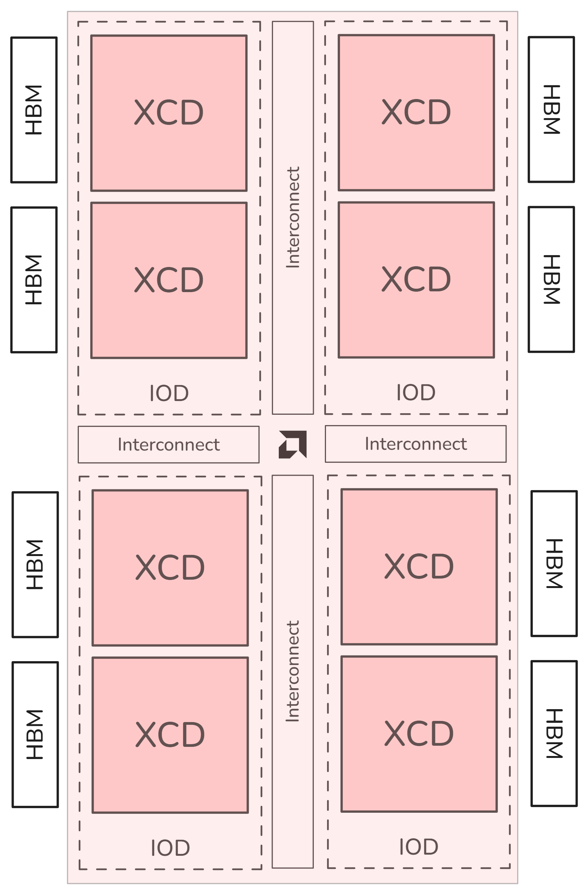
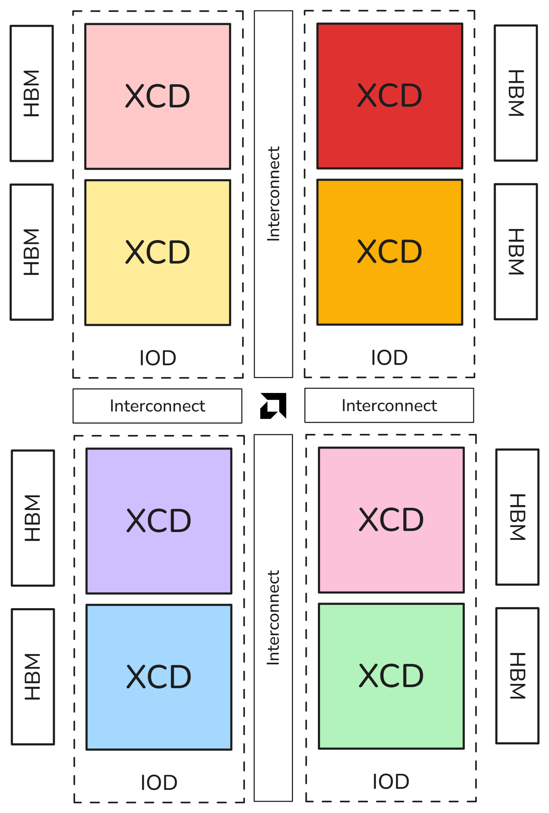
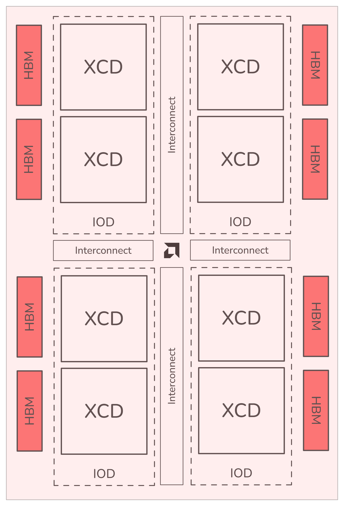
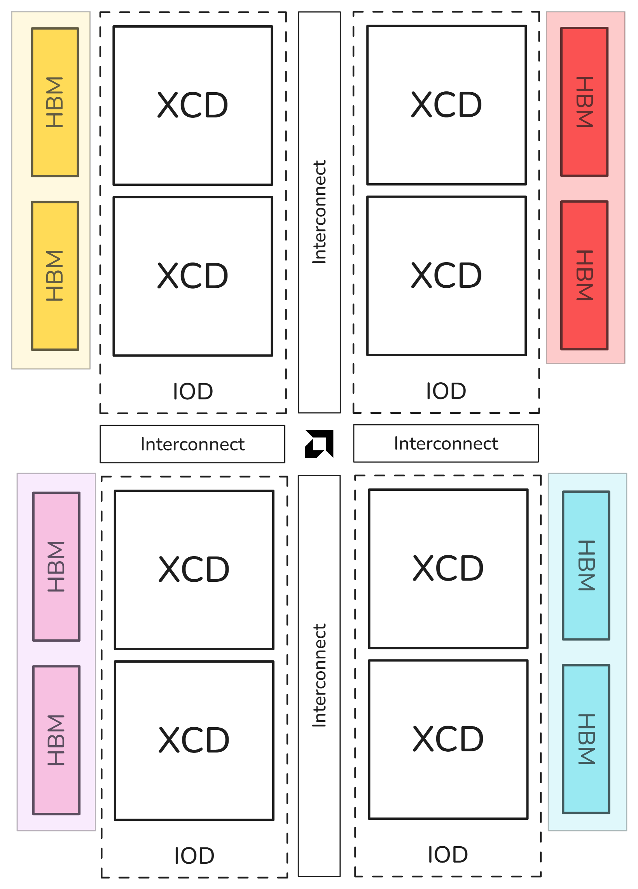
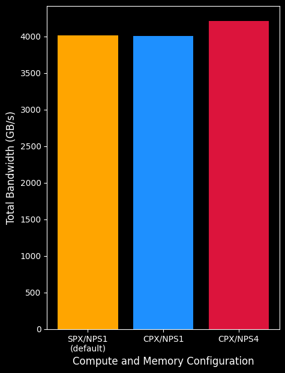
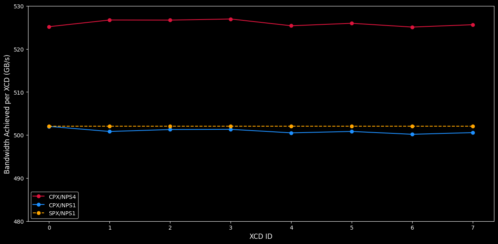
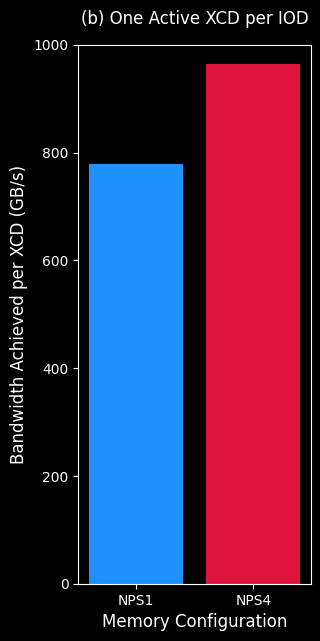
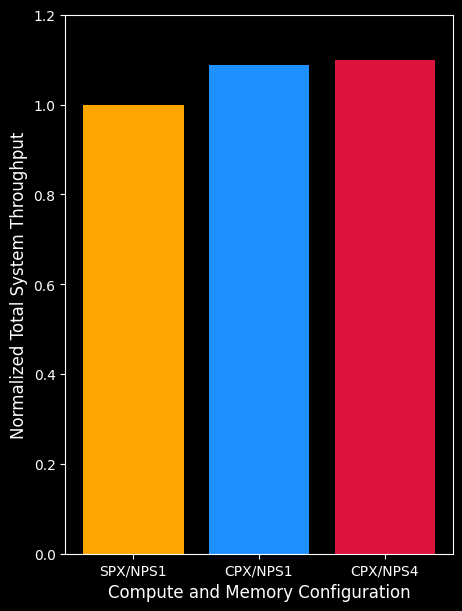
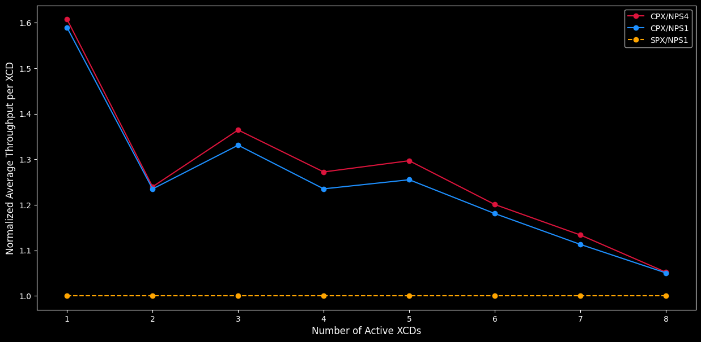
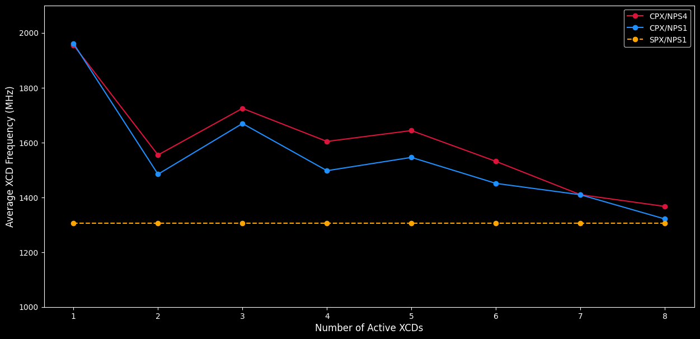

# AMD Instinct Partitioning Guide

## MI300: Architecture, compute, and memory partitions

The MI300 architecture is composed of a series of networking and compute
chiplets. In MI300, there are two different chiplet categories that are critical
in the understanding of the architecture, the XCD (Accelerator Complex Die) and
the IOD (I/O Die). A single MI300X is composed of 8 XCDs and 4 IODs. Each pair
of XCDs is 3D-stacked on the top of an IOD, which are then connected using an
inter-die interconnect. Each XCD has its own L2 cache, and each IOD contains a
network that can connect all the XCDs to the rest of the device. Additionally,
there will be some amount of higher-capacity DRAM memory attached to the device.
In MI300X, this is implemented as High-Bandwidth Memory (HBM). While memory is
typically exposed as a single pool to the programmer, it is physically
implemented as several individual "stacks". MI300X has 8 HBM stacks (2 per IOD).

For programming simplicity, these disparate elements are exposed to the
programmer as a single logical device. However, for performance critical
applications it may be worthwhile for a programmer to give up some of the
niceties of this single-pool view and instead target kernels and memory
allocations at the device's distinct elements. Towards this end, this blog
presents modes which allow the programmer to selectively change the logical view
of the device. Primarily, these modes expose the discrete architectural elements
separately. In the case of MI300X, there are memory partitioning modes, which
change the view of the memory, and compute partitioning modes which change the
view of the compute. To achieve this, the AMD Instinct MI300 Series GPUs support
Single Root IO Virtualization (SR-IOV) that provides isolation of Virtual
Functions (VFs), and protects a VF from accessing information or state of the
Physical Function (PF) of another VF.

You will find experiments in this post that demonstrate the benefits of the
compute and memory partitioning modes. For instance, it is show that
localization of memory accesses using NUMA-Per-Socket-4 (NPS4) mode enables it
to achieve 5-10% higher bandwidths in stream benchmarks.

## Compute partitioning modes

Compute partitioning modes or Modular Chiplet Platform (MCP), refers to the
logical partitioning of XCDs into devices in the ROCm stack. The names are
derived from the number of logical partitions that are created out of the eight
XCDs. In the default mode, SPX (Single Partition X-celerator), all 8 XCDs are
viewed as a single logical compute element, meaning that the `amd-smi` utility
will show a single MI300X device. In CPX (Core Partitioned X-celerator) mode
each XCD appears as a separate logical GPU, i.e., eight separate GPUs in
`amd-smi` per MI300X. CPX mode can be viewed as having explicit scheduling
privileges for each individual compute element (XCD).

### Workgroup scheduling behavior

- In the SPX mode, workgroups launched to the device are distributed round-robin
  to the XCDs in the device. Meaning that the programmer cannot have explicit
  control over which XCD a workgroup is assigned to.
- In the CPX mode, workgroups are launched to a single XCD, meaning the
  programmer has explicit control over work placement onto the XCDs.

| [](images/SPX.png) | [](images/CPX.png)  |
| ----------------------------------------------- | ------------------------------------------------ |
| **SPX:** All XCDs appear as one logical device. | **CPX:** Each XCD appears as one logical device. |

## Memory partitioning modes

While compute partitioning modes change the space on which you can assign work
to compute units, the memory partitioning modes (known as Non-Uniform Memory
Access (NUMA) Per Socket (NPS)) change the number of NUMA domains that a device
exposes. In other words, it changes the number of HBM stacks which are
accessible to a compute unit, and thus the size of its memory space. However,
for MI300, there can only be up to as many memory partitions as compute
partitions, i.e., the number of memory partitions must be less than or equal to
the number of compute partitions. NPS4 (viewing pairs of HBM stack as a
disparate element), for example is only enabled when in CPX mode (viewing each
XCD as a disparate element).

- In NPS1 mode (compatible with CPX and SPX), the entire memory is accessible to
  all XCDs.
- In NPS4 mode (compatible with CPX) Each memory quadrant of the memory is
  directly visible to the logical devices in it's quadrant. An XCD can still
  access all portions of memory through multi-GPU programming techniques.

| [](images/NPS1.png) | [](images/NPS4.png)    |
| ------------------------------------------------- | ---------------------------------------------------- |
| **NPS1:** All HBM stacks appear as one partition. | **NPS4:** Pairs of HBM stacks appear as a partition. |

### Compatibility matrix

|      | SPX (MI300X) | CPX (MI300X) |
| ---- | :----------: | :----------: |
| NPS1 |      ✔       |      ✔       |
| NPS4 |              |      ✔       |

## Quick Start Guide

[The AMD System Management Interface (amd-smi)](https://rocm.docs.amd.com/projects/amdsmi/en/latest/)
is a command-line utility that lets you monitor and manage AMD GPUs within the
ROCm software stack. It allows for the configuration of compute and memory
partitioning modes on MI300 series GPUs, through the mechanisms shown in the
example.

```console
amd-smi     set --compute-partition {CPX, SPX, TPX}   Set one of the following the compute partition modes: CPX, SPX, TPX
            set --memory-partition {NPS1, NPS4}       Set one of the following the memory partition modes: NPS1, NPS4
            reset --compute-partition                 Reset compute partitions on the specified GPU
            reset --memory-partition                  Reset memory partitions on the specified GPU
```

Sample usage:

```shell
amd-smi set --gpu all --compute-partition CPX
amd-smi set --gpu all --memory-partition NPS4
```

## Considerations when choosing the mode

| Single (Monolithic) Partition View                                                                          | Partitioned Memory and Compute View                                                                                    |
| ----------------------------------------------------------------------------------------------------------- | ---------------------------------------------------------------------------------------------------------------------- |
| Automatic placement of memory and compute; single-GPU programming over multiple memory and compute domains. | Gives the programmer more control over scheduling and memory placement.                                                |
| Coherent view of memory, no explicit communication required.                                                | Can achieve higher bandwidth and lower latency to memory, with additional small savings for kernel launch in CPX mode. |
| Simpler programming model and programmability.                                                              | Can save power, and achieve closer to peak efficiency of the device.                                                   |

## Working with partitioned devices

This section introduces methodologies for system administrators or programmers
to interact with partitioned devices through provided tools and APIs.

### Multi-GPU/Multi-Partition programming

Working with partitioned devices is no different than simple multi-GPU
programming. With partitioned GPUs, the user is just exposed to more GPUs in the
system than the available physical GPUs, and programs them using the existing
multi-GPU programming APIs and techniques. This blog highlights two simple
use-cases, the first through C/C++ HIP (Heterogeneous-computing Interface for
Portability) APIs and the second using Python (PyTorch).

#### Using HIP APIs

AMD provides
[HIP APIs](https://rocm.docs.amd.com/projects/HIP/en/docs-6.3.2/how-to/hip_runtime_api.html)
that allows C/C++ interaction with the HIP runtime. This includes the ability to
select dynamically in C/C++ code which allows developers to gather information
about available GPUs and set their GPU targets directly from their C++ code.

- `hipSetDevice(int deviceId)`: Sets the GPU device to be used for subsequent
  HIP Operations, device allocations, and launches.
- `hipGetDevice(int* deviceId)`: Retrieves the current device ID.
- `hipStream_t`: Represents a stream in which HIP kernels are launched and
  synchronized.
- `hipStreamSynchronize(hipStream_t stream)`: Synchronizes and waits for all
  kernels in a stream to complete.

A simple vector add kernel to use as an example for multi-partition programming:

```cpp
#include <hip/hip_runtime.h>
#include <iostream>
#include <vector>

__global__ void vector_add(const float* A, const float* B, float* C, int n) {
    int i = blockIdx.x * blockDim.x + threadIdx.x;
    if (i < n)
        C[i] = A[i] + B[i];
}
```

A driver function to setup data and streams on available GPUs, and launch a
section of the work on partitioned devices using streams:

```cpp
int main() {

    // Get number of available partitioned devices
    int num_devices = 0;
    hipGetDeviceCount(&num_devices);
    std::cout << "Number of available GPUs: " << num_devices << "\n";

    // Size of vectors
    constexpr int N = 1 << 20;

    // Host vectors
    std::vector<float> h_A(N, 1.0f);
    std::vector<float> h_B(N, 2.0f);
    std::vector<float> h_C(N, 0.0f);

    // Partition data between GPUs
    int chunk_size = N / num_devices;

    // Store device pointers and GPU streams
    std::vector<float*> A(num_devices);
    std::vector<float*> B(num_devices);
    std::vector<float*> C(num_devices);

    std::vector<hipStream_t> streams(num_devices);

    // Launch computations on each GPU partition on separate streams
    for (int dev = 0; dev < num_devices; ++dev) {
        hipSetDevice(dev);  // Set active device

        int offset = dev * chunk_size;
        int size = (dev == num_devices - 1) ? (N - offset) : chunk_size;

        // Allocate device memory
        hipMalloc(&A[dev], size * sizeof(float));
        hipMalloc(&B[dev], size * sizeof(float));
        hipMalloc(&C[dev], size * sizeof(float));

        // Create stream
        hipStreamCreate(&streams[dev]);

        // Copy data to device
        hipMemcpyAsync(A[dev], h_A.data() + offset, size * sizeof(float), hipMemcpyHostToDevice, streams[dev]);
        hipMemcpyAsync(B[dev], h_B.data() + offset, size * sizeof(float), hipMemcpyHostToDevice, streams[dev]);

        // Launch kernel on GPU/GPU partition
        int block_size = 256;
        int grid_size = (size + block_size - 1) / block_size;
        hipLaunchKernelGGL(vector_add, dim3(grid_size), dim3(block_size), 0, streams[dev], A[dev], B[dev], C[dev], size);

        // Copy result back to host
        hipMemcpyAsync(h_C.data() + offset, C[dev], size * sizeof(float), hipMemcpyDeviceToHost, streams[dev]);
    }

    // Synchronize all streams
    for (int dev = 0; dev < num_devices; ++dev) {
        hipSetDevice(dev);
        hipStreamSynchronize(streams[dev]);
    }

    // Verify results
    for (int i = 0; i < N; ++i) {
        if (h_C[i] != 3.0f) {
            std::cerr << "Verification failed at index: " << i << "\n";
            return -1;
        }
    }

    std::cout << "Verification succeeded." << std::endl;

    // Cleanup
    for (int dev = 0; dev < num_devices; ++dev) {
        hipSetDevice(dev);
        hipFree(A[dev]);
        hipFree(B[dev]);
        hipFree(C[dev]);
        hipStreamDestroy(streams[dev]);
    }

    return 0;
}
```

#### Using PyTorch in Python

PyTorch is a flexible deep learning framework in python with dynamic computation
graphs, automatic differentiation, and GPU acceleration for training and
inference. It supports a broad range of AI applications, from vision to NLP.
ROCm supports PyTorch, enabling high-performance execution on AMD GPUs. PyTorch
APIs can also utilize compute and memory partitioning modes through their own
multi-device management APIs.

- `torch.cuda.set_device(device_id)`: Sets the default device.
- `torch.cuda.current_device()`: Returns the index of the current device.
- `torch.cuda.Stream()`: Creates a stream for asynchronous operations.
- `torch.cuda.synchronize(device=None)`: Waits for all kernels in all streams on
  a device to complete.

In the PyTorch/Python example, the same techniques as the HIP code have been
used; get available devices, set an active device, allocate/initialize the data
for that device, and launch the GPU kernel. The only difference is, in addition
to a multi-GPU kernel launch, `torch.multiprocessing` is also used to launch all
the work in parallel using CPU threads.

```{note}
The 'spawn' start method starts a fresh Python interpreter process. It
ensures that the child process doesn't inherit any unnecessary resources from
the parent, including the HIP/CUDA context. This method is safer when working
with HIP/CUDA and multiprocessing.
```

```python
import torch
import torch.multiprocessing as mp

# Function to perform matrix multiplication on a GPU
def gpu_matrix_multiplication(device_id, size):
    torch.cuda.set_device(device_id)
    print(f"Running on device {torch.cuda.current_device()}")

    # Create tensors on the device
    with torch.cuda.device(device_id):
        a = torch.randn(size, size, device=device_id)
        b = torch.randn(size, size, device=device_id)

        # Create a stream
        stream = torch.cuda.Stream(device=device_id)

        # Perform computation in the stream
        with torch.cuda.stream(stream):
            c = torch.mm(a, b)

        # Synchronize the stream
        stream.synchronize()

if __name__ == "__main__":
    mp.set_start_method('spawn') # Required for multiprocess w/ HIP/CUDA
    num_devices = torch.cuda.device_count()

    N = 256  # Size of the matrices (NxN)
    processes = []

    for device_id in range(num_devices):
        # Start a process for each GPU
        p = mp.Process(target=gpu_matrix_multiplication, args=(device_id, N))
        p.start()
        processes.append(p)

    for p in processes:
        p.join()
```

### GPU isolation techniques

To target specific logical devices, typical GPU isolation techniques such as
`HIP_VISIBLE_DEVICES` or `ROCR_VISIBLE_DEVICES` can be used.

- `HIP_VISIBLE_DEVICES` is an environment variable used in AMD ROCm (Radeon Open
  Compute) platform, specifically with the HIP programming model.
- `ROCR_VISIBLE_DEVICES` environment variable is part of AMD's ROCm platform. It
  allows users to specify which GPUs are visible to their ROCm applications.
  Both individual users and system-level job schedulers (like those used with
  MPI applications) can set this variable to control GPU assignments and
  resource allocation.

ROCm documentation for
[GPU isolation techniques](https://rocm.docs.amd.com/en/latest/conceptual/gpu-isolation.html)
discusses this in detail. However, in this blog you can see some simple examples
of using both `HIP_VISIBLE_DEVICES` set by the user and `ROCR_VISIBLE_DEVICES`
to work with partitioned devices.

Using MI300X in CPX mode as an example, a system will now report `64` GPUs,
assuming an 8xMI300X system. GPU isolation techniques now have access to GPU
indices ranging from `0` to `63`. An example of making IDs 9, 10, 11 and 63
available as a user would be:

```shell
export HIP_VISIBLE_DEVICES=9,10,11,63
```

#### MPI job scheduler

The user can also use an MPI launcher (such as `mpirun` from OpenMPI) to assign
specific GPUs to individual MPI processes. MPI allows the user to set
environment variables for each process separately.

```shell
mpirun \
  -np 1 -x ROCR_VISIBLE_DEVICES=0,8,16,32 ./my_application : \
  -np 1 -x ROCR_VISIBLE_DEVICES=1,9,17,33 ./my_application
```

- `mpirun` launches MPI processes.
- `-np 1` specifies the number of processes for the following command segment.
- `-x ROCR_VISIBLE_DEVICES=0,8,16,32` exports `ROCR_VISIBLE_DEVICES=0,8,16,32`
  to the process, making only the first CPX partition from each physical GPU
  (assuming 8xMI300X system) visible to the application.
- The second segment runs another process but with
  `ROCR_VISIBLE_DEVICES=1,9,17,33` so the second CPX partition from each
  physical GPU is visible to it.
- Each process runs `./my_application` with its assigned GPU.

### Deployment through Docker

Alternatively, Docker supports attaching a device to the Docker container, this
is typically done using the `--device=/dev/dri` command to allow the container
to see all the GPUs in the system. However, since MI300 exposes each XCD as a
separate render device, the numbering differs slightly.
`ls /dev/dri | grep renderD` prints out all the render IDs, with each associated
to an individual XCD. In the examples, the render IDs start from `renderD128`
and go all the way to `renderD191`. One way to utilize this information is by
first understanding that the physical GPU's first physical XCD begins at `D128`.
Given this, the next physical GPU will be a #XCD/device offset from the first,
so in MI300X the next physical GPU is `D128+8=136`, Device 2 will then
be`D136+8=144` and so on. All the IDs in between 128 and 136 are CPX partitions
of a single MI300X.

**Example 1:** CPX 0 of physical GPU 0:

```shell
docker run -it --network=host --device=/dev/kfd \
  --device=/dev/dri/renderD128 \
  --group-add video --security-opt seccomp=unconfined -v $HOME:$HOME -w $HOME rocm/pytorch
```

**Example 2:** All CPX devices of physical GPU 0 (MI300X):

```shell
docker run -it --network=host --device=/dev/kfd \
  --device=/dev/dri/renderD128 \
  --device=/dev/dri/renderD129 \
  --device=/dev/dri/renderD130 \
  --device=/dev/dri/renderD131 \
  --device=/dev/dri/renderD132 \
  --device=/dev/dri/renderD133 \
  --device=/dev/dri/renderD134 \
  --device=/dev/dri/renderD135 \
  --group-add video --security-opt seccomp=unconfined -v $HOME:$HOME -w $HOME rocm/pytorch
```

**Example 3:** CPX 0 from each physical GPU (MI300X):

```shell
docker run -it --network=host --device=/dev/kfd \
  --device=/dev/dri/renderD128 \
  --device=/dev/dri/renderD136 \
  --device=/dev/dri/renderD144 \
  --device=/dev/dri/renderD152 \
  --device=/dev/dri/renderD160 \
  --device=/dev/dri/renderD168 \
  --device=/dev/dri/renderD176 \
  --device=/dev/dri/renderD184 \
  --group-add video --security-opt seccomp=unconfined -v $HOME:$HOME -w $HOME rocm/pytorch
```

### AMD SMI

Using MI300X in CPX mode as an example, a system will now report `64` GPUs
(assuming an 8xMI300X system) with `amd-smi` starting from `0` to `63`. The
following output also prints out the physical Universally Unique Identifier
(UUID) of the GPU, `gpu_uuid`, which is same across all virtual partitions for a
given physical GPU.

```console
amd-smi list --csv
gpu,gpu_bdf,gpu_uuid
0,0000:0c:00.0,c0ff74a1-0000-1000-80b1-06985c515c91
1,0000:0c:00.0,c0ff74a1-0000-1000-80b1-06985c515c91
2,0000:0c:00.0,c0ff74a1-0000-1000-80b1-06985c515c91
3,0000:0c:00.0,c0ff74a1-0000-1000-80b1-06985c515c91
4,0000:0c:00.0,c0ff74a1-0000-1000-80b1-06985c515c91
5,0000:0c:00.0,c0ff74a1-0000-1000-80b1-06985c515c91
6,0000:0c:00.0,c0ff74a1-0000-1000-80b1-06985c515c91
7,0000:0c:00.0,c0ff74a1-0000-1000-80b1-06985c515c91
...
56,0000:df:00.0,bbff74a1-0000-1000-80b0-9363b4d6f06e
57,0000:df:00.0,bbff74a1-0000-1000-80b0-9363b4d6f06e
58,0000:df:00.0,bbff74a1-0000-1000-80b0-9363b4d6f06e
59,0000:df:00.0,bbff74a1-0000-1000-80b0-9363b4d6f06e
60,0000:df:00.0,bbff74a1-0000-1000-80b0-9363b4d6f06e
61,0000:df:00.0,bbff74a1-0000-1000-80b0-9363b4d6f06e
62,0000:df:00.0,bbff74a1-0000-1000-80b0-9363b4d6f06e
63,0000:df:00.0,bbff74a1-0000-1000-80b0-9363b4d6f06e
```

`amd-smi` also supports useful commands like `amd-smi static --partition`, which
for each GPU prints the memory and compute partition mode. For example, the
following MI300X system is in CPX, NPS1 partition for all GPUs.

```console
amd-smi static --partition
GPU: 0
    PARTITION:
        COMPUTE_PARTITION: CPX
        MEMORY_PARTITION: NPS1

GPU: 1
    PARTITION:
        COMPUTE_PARTITION: CPX
        MEMORY_PARTITION: NPS1

GPU: 2
    PARTITION:
        COMPUTE_PARTITION: CPX
        MEMORY_PARTITION: NPS1
...
```

### Using Linux control groups

[Control Groups](https://docs.kernel.org/admin-guide/cgroup-v1/cgroups.html)
(cgroups) is a Linux kernel feature that enables fine-grained management of
device access for processes or groups. This functionality can also be leveraged
to control access to individual partitions within an MI300 device at the linux
kernel level. To effectively utilize cgroups in this way, it is essential to
understand how to enable and restrict access to render devices using this
mechanism.

First, you need a grasp on major and minor descriptors of devices as found in
`/dev/dri`.

```console
$ ls -l /dev/dri/
crw-rw---- 1 root render 226, 128 Jan 13 19:42 renderD128
crw-rw---- 1 root render 226, 129 Jan 13 19:42 renderD129
crw-rw---- 1 root render 226, 130 Jan 13 19:42 renderD130
crw-rw---- 1 root render 226, 131 Jan 13 19:42 renderD131
crw-rw---- 1 root render 226, 132 Jan 13 19:42 renderD132
crw-rw---- 1 root render 226, 133 Jan 13 19:42 renderD133
crw-rw---- 1 root render 226, 134 Jan 13 19:42 renderD134
```

In the `ls -l` of `/dev/dri` there is one column containing 226, and one
containing the render IDs 128,129, and so on. These are the major and minor IDs
of these individual render devices, cgroups takes these IDs as input to refer to
a specific device.

The render IDs start from `renderD128` and go all the way to `renderD191` for an
8 GPU MI300X system. One way to utilize this information is by first
understanding that the physical GPU's first physical XCD begins at `D128`. Given
this, the next physical GPU will be a #XCD/device offset from the first, so in
MI300X the next physical GPU is `D128+8=136`, Device 2 will then be`D136+8=144`
and so on. All the IDs in between 128 and 136 are CPX partitions of a single
MI300X.

The cgroups linux kernel feature allows you to isolate access to resources to
various groups. On an Ubunutu machine, you can find cgroup controls at
`/sys/fs/cgroup` and control over devices at `/sys/fs/cgroup/devices`. In
`/sys/fs/cgroup/devices` there will be endpoints named `devices.allow` and
`devices.deny`. Using `>` we can feed information to these endpoints. For
example, if you wish to deny access to the first XCD in the first device through
cgroups, you can use the command:

```console
echo "c 226:128 rwm" > /sys/fs/cgroup/devices/devices.deny #Deny access to device 226:128 (renderD128)
```

Similarly, to allow access to the first XCD in the first device you can use:

```console
echo "c 226:128 rwm" > /sys/fs/cgroup/devices/devices.allow #Allow access to device 226:128 (renderD128)
```

Where 128 is the "minor" identifier of the device as identified above.

This form of isolation also works in docker containers through different cgroup
endpoints. The same process on these different endpoints will isolate the GPUs
accesible from containers:

```console
echo "c 226:128 rwm" > /sys/fs/cgroup/devices/devices.deny #Deny access to device 226:128 in docker (renderD128)

echo "c 226:128 rwm" > /sys/fs/cgroup/devices/devices.allow #Allow access to device 226:128 in docker (renderD128)
```

:::{note}
This section described functionality using the cgroups version 1 API. Instructions to use cgroup version 2 API are the subject of a future article.
:::

## Performance evaluation

For performance evaluation of partitioned memory and compute modes, two case
studies considered are:

1. A Parallel Stream Microbenchmark
2. A General Matrix Multiplication (GEMM) Benchmark

::::{important}
The presented simple Stream and GEMM kernels are implemented using Triton
and HIP, they are not intended to represent the peak performance
achievable using MI300X. There might be more throughput/bandwidth left that
is further extractable through performance engineering.
::::

### Stream microbenchmark

A streaming microbenchmark can be used to determine the maximum achievable
memory bandwidth of the NPS1 and NPS4 mode. For this experiment, Triton
`copy_kernel` is provided below, which loads values from a 1-D tensor `x_ptr`,
and stores it in a 1-D tensor `y_ptr`.

```py
@triton.jit
def copy_kernel(
    x_ptr, y_ptr, n_elements, BLOCK_SIZE: tl.constexpr, dtype: tl.constexpr
):
    pid = tl.program_id(0)
    offsets = pid * BLOCK_SIZE + tl.arange(0, BLOCK_SIZE)
    mask = offsets < n_elements
    x = tl.load(x_ptr + offsets, mask=mask).to(dtype)
    tl.store(y_ptr + offsets, x, mask=mask)
```

Utilizing the CPX/NPS4 memory partitioning mode, the total data is split across
four memory domains (2 HBM stacks per memory domain, one memory domain per IOD),
and a separate kernel is launched to each CPX device. This results in each XCD
accessing only its closest memory, which results in no inter-IOD traffic. Due to
this improved localization of memory reads, NPS4 mode will typically achieve a
higher peak bandwidth than in NPS1 mode, at the cost of additional complexity to
write a program which utilizes multiple partitions.

Figure 1a., shows the aggregate achieved bandwidth of different compute and
memory partitions. The total achieved bandwidth of an MI300X in CPX/NPS4 mode
performing reads across all eight XCDs is approximately 4210 GB/s, as opposed to
4010 in CPX/NPS1 and 4017 TB/s in SPX/NPS1. Although NPS4 seems to provide
better performance benefits for a simple stream microbenchmark, it is important
to note that complex applications may require communication across the memory
partitions (e.g. using high-performant communication collectives) and may see
smaller performance benefits than an embarrassingly parallel workload. Figure
1b. provides additional analysis of the achieved bandwidth per individual XCD
for an MI300X.



**Figure 1a.** The total achieved bandwidth (across the entire system) for the
different modes. CPX/NPS4 is able to achieve significantly higher bandwidth due
to localization of accesses to main memory. CPX/NPS1 achieves higher memory
bandwidth than SPX/NPS1.



**Figure 1b.** Bandwidth of the streaming benchmark running concurrently on all
8 XCDs of one physical GPU 0. CPX/NPS4 achieves higher bandwidth due to improved
localization of memory accesses to local HBM stacks.

```{note}
SPX mode always runs all 8 XCDs, the graphs with the dotted SPX line
illustrate metric divided by 8 to show per-XCD average frequency.
```

#### Leveraging an IOD's available bandwidth with a single XCD

Figure 2a. and Figure 2b. illustrate the capability of a single MI300X chiplet
to leverage the entire IOD's bandwidth. This experiment uses the same stream
microbenchmark in CPX mode, but run it across only 4 out of the 8 available XCDs
on MI300X. In one setup (Figure 2a.) the 4 active XCDs are grouped to only 2
IODs, and in the second setup (Figure 2b.) the 4 active XCDs are spread across
all 4 IODs, with one XCD active per IOD.

|                                               |                                                                   |
| ------------------------------------------------------------------------------------------------- | ------------------------------------------------------------------------------------------------------------------- |
| **Figure 2a.** Stream microbenchmark on XCDs 0,1,2,3. Two active XCDs per IOD, and 2 active IODs. | **Figure 2b.** Stream microbenchmark on XCDs 0,2,4,6. Only a single active XCDs per IOD, and all 4 IODs are active. |

In such scenarios, operating in NPS4 mode allows the single active XCD to
utilize the entire available bandwidth of that IOD achieving ~1TB/s bandwidth on
its own. While the other XCDs—which share their IOD's bandwidth with another
active XCD on the same IOD—achieves only half the bandwidth. The same benefit is
not as pronounced in NPS1 mode, because the data is paged across all HBM stacks,
i.e. all active XCDs are requesting data from all HBMs.

However, these figures also illustrate the downside of NPS4 mode (Figure 2a.).
When compared to the NPS1 mode, NPS4 achieves half the bandwidth when all XCDs
on an IOD are active versus the case where a single XCD is active. NPS1 mode on
the other hand achieves approximately the same effective bandwidth per XCD
regardless of having a single XCD active per IOD or all XCDs active across all
IOD. This is because in NPS1 mode, each XCD has all IODs' bandwidth available
with data interleaved across all HBM stacks, while in the memory partitioned
mode (NPS4), the data is only interleaved across the local HBMs, and an XCD only
has access to the local IOD's available bandwidth.

A developer can leverage this principle in workloads that lack sufficient
parallelism to utilize all XCDs. For example, latency- or bandwidth-bound
applications that are not highly sensitive to a reduction in total compute
resources can be efficiently mapped to a single XCD for improved performance, as
that single XCD can take full advantage of the entire bandwidth.

### General Matrix Multiplication (GEMM) benchmark

This section will look at a more computation-bound kernel: General Matrix Matrix
Multiply (GEMM), defined as $C = \alpha AB + \beta C$, where $\alpha$ and
$\beta$ are scalars, $A$, $B$ are input matrices, and $C$ is the output matrix.
For this particular GEMM microbenchmark, a size is chosen in the compute bound
region (where MxNxK = 16384x16384x4096) using FP16 precision. For these plots,
CPX/NPS4 and CPX/NPS1 results are presented in which progressively more XCDs are
run concurrently. Also included in the plots are results from SPX/NPS1 baseline
in which **all 8 XCDs run concurrently**.



**Figure 3.** A plot of the total system throughput (Y-axis) for various compute
and memory partitioning modes (X-axis) aggregate across all XCD. Where each XCD
in CPX runs a separate GEMM operation, and a single MI300X runs a GEMM operation
in SPX. CPX/NPS1 and CPX/NPS4 modes are able to achieve 10-15% higher total
system throughput than SPX mode. CPX/NPS4 is able to achieve higher throughput
than CPX/NPS1.



**Figure 4.** The plot shows the average throughput (TFLOPS) per XCD when each
XCD in CPX runs a separate GEMM operation, and a single MI300X runs a GEMM
operation in SPX. The Y-axis represents the average throughput per XCD, while
the X-axis indicates the number of concurrently running XCDs, from 1 to 8 (SPX
always runs all 8 XCDs). As more XCDs run concurrently, the throughput per XCD
decreases due to competition for shared resources like bandwidth (as discussed
earlier). CPX/NPS4 is able to achieve higher throughput than both CPX/NPS1 and
SPX/NPS1 due to its improved localized memory acceses, allowing its clocks to
run at higher rates.



**Figure 5**. A plot of the average frequency (y-axis) of a device running the
same workload in CPX/NPS4 mode, plotted against the number of concurrently
running XCDs (x-axis). This plot mirrors the earlier "Performance per XCD" graph
because an XCD's performance is closely linked to its operating frequency.
CPX/NPS4 is able to run at a consistently higher compute clock speed than both
CPX/NPS1 and SPX/NPS1 due to increased localized accesses. Both CPX/NPX4 and
CPX/NPS1 are able to run at a faster compute clock than SPX/NPS1 due to improved
use of the caches in CPX mode.

```{note}
SPX mode always runs all 8 XCDs, the graphs with the dotted SPX line
illustrate metric divided by 8 to show per-XCD average frequency.
```
